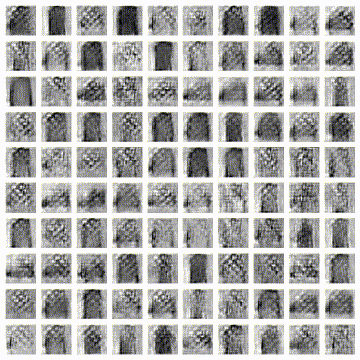

# 行列の正則化
2020/01/09 @kotan.kn

---
### ニューラルネットワークでの行列演算
$$XW=Y$$

+++

## 本発表での主張

+++  

## 各層の$W$について$W^TW$ はできるだけ単位行列になるよう正則化されるべき
(Wが正方行列ならWは直交行列になるべき)

+++  
### ニューラルネットワークでの特徴量フィルタ1
$$XW=Y$$
  
 - $X$: 入力(行: サンプル次元, 列: 特徴量$\in\mathbb{R}$)
 - $Y$: 出力(行: サンプル次元, 列: 特徴量$\in\mathbb{R}$)
 - $W$: $X$の特徴量空間$\rightarrow$$Y$の特徴量空間の写像行列

+++
### NNでの特徴量フィルタ2
`$$\left[\begin{matrix} 
x_{0,0} & x_{0,1} & \cdots \\ 
x_{1,0} & x_{1,1} & \cdots \\ 
\vdots & \vdots & \ddots 
\end{matrix}\right]
\left[\begin{matrix} 
w_{0,0} & w_{0,1} & \cdots \\ 
w_{1,0} & w_{1,1} & \cdots \\ 
\vdots & \vdots & \ddots 
\end{matrix}\right] = 
\left[\begin{matrix} 
y_{0,0} & y_{0,1} & \cdots \\ 
y_{1,0} & y_{1,1} & \cdots \\ 
\vdots & \vdots & \ddots 
\end{matrix}\right]$$`

+++

`$$
y_{i,j}=\sum_{k}x_{i,k}w_{k,j}
$$`

 - 行列$W$の$j$列目と入力$X$の行ベクトルの相関 
 - 列次数分の$W$フィルタを用意して$X$の特徴量をフィルタリングする 
 - 各種フィルタの効果が似ていると同じ特徴をみてしまい効率が低下する
 - つまり$W$の列ベクトルは **一次独立** であるべき |

+++
### 列ベクトルが一次独立であるということは
自己相関行列 $W^TW$が **対角行列** であるということ

`$$
W^TW=\left[\begin{matrix} 
\lambda_0 & 0 & 0 & \cdots \\
0 & \lambda_1 & 0 & \cdots \\
0 & 0 & \lambda_2 & \cdots \\
\vdots & \vdots & \vdots & \ddots
\end{matrix}\right]
$$`

+++  

### 自己相関行列$W^TW$の対角成分のスケールは同じ幅であるべき
 - 対角成分=特徴フィルタのノルム
 - ノルムにばらつきがあると出力される特徴量のスケールもばらける
 - フィルタのノルムが異なる=共変量シフトの原因

+++  

### 自己相関行列$W^TW$の対角成分のスケールは1に近いべき
NNでは多層化された行列演算が通例  
$F(WX_0)=X_1,~F(WX_1)=X_2,~F(WX_2)=X_3,~\cdots$
  
各層で特徴量のスケーリングに差異があるとデメリットしかない
 - 層の重みの負担率がばらける  
 - ヘッセ行列が歪み学習が難しくなる

+++  

### 自己相関行列$W^TW$の固有値は$1$に近いべき
  
 - 特にRNNでは出力が再起する
   - $F\left( WX_t\right) = X_{t+\Delta t}$
   - 大きい固有値に対応したベクトルばかり強調される
     - $1$以上だと発散する
 - $W^TW$の固有値$=$$W$の特異値の二乗
 - $W$の特異値が全て$1$ならば良い
  
---  

## ところで

+++  

 - 自己相関行列が単位行列 
 - 特異値が全て1
 - この二つは等価である | 

+++  

証明  

+++  

$W=U\Sigma V^T$
のとき
$W^TW=(U\Sigma V^T)^T(U\Sigma V^T)=V\Sigma^TU^TU\Sigma V^T$
  
+++  

$W^TW=V\Sigma^TU^TU\Sigma V^T$  
$U$は直交行列なので$U^TU=I$  
$\Sigma$は対角行列なので$\Sigma^T\Sigma=\Sigma^2$  
すなわち$W^TW=V^T\Sigma^2V$  
  
加えて$V$も直交行列なので  
$W^TW=V^T\Sigma^2V=I$になる条件は$\Sigma=I$  

+++  

つまり，$W^TW$を単位行列に近づけること  
=Wの特異値を全て$1$に正則化すること

+++  

特徴量

---  

結果  

+++  

+++  

+++  

