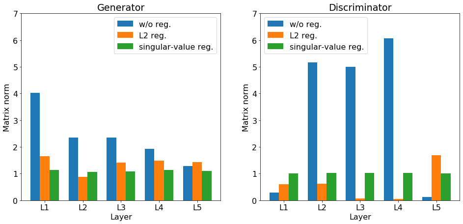

# 行列の正則化
2020/01/09 @kotan.kn

---
## ニューラルネットワークでの行列演算
$$XW=Y$$
 - $X$: 入力(行=標本, 列=特徴量)
 - $W$: 重み行列=特徴フィルタの集合
 - $Y$: 出力=フィルタされた入力(行=標本, 列=特徴量)

---

## 本発表での主張

---  

## 各層の$W$について$W^TW$ はできるだけ単位行列になるよう正則化されるべき
($W$が正方行列なら$W$は直交行列になるべき)

---  
## ニューラルネットワークでの特徴量フィルタ1
$$XW=Y$$
  
 - $X$: 入力(行: サンプル次元, 列: 特徴量$\in\mathbb{R}$)
 - $Y$: 出力(行: サンプル次元, 列: 特徴量$\in\mathbb{R}$)
 - $W$: $X$の特徴量空間$\rightarrow$$Y$の特徴量空間の写像行列

---
### NNでの特徴量フィルタ2
`$$\left[\begin{matrix} 
x_{0,0} & x_{0,1} & \cdots \\ 
x_{1,0} & x_{1,1} & \cdots \\ 
\vdots & \vdots & \ddots 
\end{matrix}\right]
\left[\begin{matrix} 
w_{0,0} & w_{0,1} & \cdots \\ 
w_{1,0} & w_{1,1} & \cdots \\ 
\vdots & \vdots & \ddots 
\end{matrix}\right] = 
\left[\begin{matrix} 
y_{0,0} & y_{0,1} & \cdots \\ 
y_{1,0} & y_{1,1} & \cdots \\ 
\vdots & \vdots & \ddots 
\end{matrix}\right]$$`

---

`$$
y_{i,j}=\sum_{k}x_{i,k}w_{k,j}
$$`

 - 行列$W$の$j$列目と入力$X$の行ベクトルの相関 
 - 列次数分の$W$フィルタを用意して$X$の特徴量をフィルタリングする 
 - 各種フィルタの効果が似ていると同じ特徴をみてしまい効率が低下する
 - つまり$W$の列ベクトルは **一次独立** であるべき |

---
### 列ベクトルが一次独立
自己相関行列 $W^TW$が **対角行列** であるということ

`$$
W^TW=\left[\begin{matrix} 
\lambda_0 & 0 & 0 & \cdots \\
0 & \lambda_1 & 0 & \cdots \\
0 & 0 & \lambda_2 & \cdots \\
\vdots & \vdots & \vdots & \ddots
\end{matrix}\right]
$$`

---  

## 自己相関行列$W^TW$の対角成分のスケールは同じ幅であるべき
 - $W^TW$の対角成分$=$特徴フィルタのノルム
 - ノルムにばらつきがあると出力される特徴量のスケールもばらける
 - フィルタのノルムが異なる$=$共変量シフトの原因
   - 特定のフィルタのみ過敏に反応

---  

 自己相関行列$W^TW$の対角成分のスケールは1に近いべき
NNでは行列演算が多層化
$F(WX_0)=X_1,~F(WX_1)=X_2,~F(WX_2)=X_3,~\cdots$
  
各層でスケーリングが異なるとフィルタの学習速度が層ごとに異なる
 - 層の重みの負担率がばらける  
 - ヘッセ行列が歪み学習が難しくなる

---  

## 自己相関行列$W^TW$の固有値は$1$に近いべき
 - 各層の行列積で入出力の行列のスケールは等しいべき
   - 大きい固有値に対応したベクトルばかり強調される
   - $1$以上だと発散する
 - 特にRNNでは出力が再起するのでスケールの影響を強く受ける|  
 - $W^TW$の固有値 $=$ $W$の特異値の二乗|
  
---  

## ところで

---  

 - 自己相関行列が単位行列 
 - 特異値が全て1
 - この二つは等価である  

---  

証明  

---  

$W=U\Sigma V^T$
のとき
$W^TW=(U\Sigma V^T)^T(U\Sigma V^T)=V\Sigma^TU^TU\Sigma V^T$
  
---  

$W^TW=V\Sigma^TU^TU\Sigma V^T$  
$U$は直交行列なので$U^TU=I$  
$\Sigma$は対角行列なので$\Sigma^T\Sigma=\Sigma^2$  
すなわち$W^TW=V^T\Sigma^2V$  
  
$V$も直交行列なので  
$W^TW=V^T\Sigma^2V=I$になる条件は$\Sigma=I$  

---  

つまり，$W^TW$を単位行列に近づけること  
=Wの特異値を全て$1$に正則化すること

---    

## 本発表の主張
### $W^TW$の特異値が$1$になるように正則化を行う

---

## 各正則化
`$$
W=\left[\begin{matrix}
 w_{0, 0} & w_{0, 1} & \cdots \\
 w_{1, 0} & w_{1, 1} & \cdots \\
 \vdots & \vdots & \ddots
\end{matrix}\right]
$$`  
  
 - 正則化に必要な損失を加算
   - L1正則化: $\epsilon\sum\|w_{i,j}\|$
   - L2正則化: $\epsilon\sum w_{i,j}^2$
   - 特異値正則化: ($W^TW=E$時に損失が$\mathbb{0}$)

---

## 正則化項の設計
 - 二種類設計できる
   1. $\rm{tr}\left(M\right)-\log\det\left|M\right|-D$
    - $M=W^TW$, $D$は行列の次数
    - $\det\|M\|$が発散しがち
    - コレスキー分解を経て高速に演算可能
   2. $\rm{tr}\left(\Sigma-\log\Sigma-E\right)\Leftrightarrow$
    - $U\Sigma V^T=W$
    - 演算量は多いが数値的に安定
    - 本発表ではこちらを採用
  
---
  
## 数値実験
正則化の影響で過学習を防ぎ各フィルタを効率的に用いているか分析
 - タスク: DCGAN
   - 正則化しなければmode collapseしやすい
 - 生成モデル: Dense1層$\rightarrow$Conv4層
 - 識別モデル: Conv4層$\rightarrow$Dense1層
 - データセット: MNIST, Fashion-MNIST
 - その他の条件: 割愛(ipynb参照)

---  
  
## MNISTでの学習結果
  
---
  
### 学習後の特異値の分布

  
---   

### 各層のノルム

  
---  
  
### 各epochごとの学習段階で生成される画像
  
| 正則化なし | L2正則化 | 特異値正則化 |
|:--------:|:-------:|:----------:|
|  |  |  |
  
---  
  
## Fashion-MNISTでの学習結果
  
---
  
### 学習後の特異値の分布

  
---   

### 各層のノルム

  
---  
  
### 各epochごとの学習段階で生成される画像
  
| 正則化なし | L2正則化 | 特異値正則化 |
|:--------:|:-------:|:----------:|
|  |  |  |
  
---  

## まとめと展望
 - 本発表ではNNの行列は正則化されるべきと主張
 - 自己相関行列を単位行列にするか特異値を$1$にする正則化手法を提案
  - 目的とする挙動は等価
 - DCGANの数値実験ではmode collapseがなく理想とする結果が得られた
 - できればもっと高分解能なモデルにも適用したい(が$\cdots\cdots$)